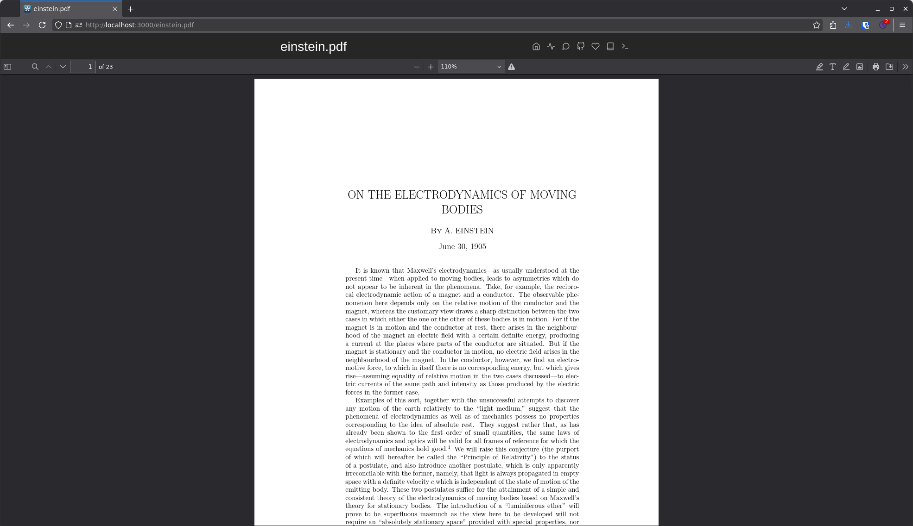

# Silverbullet PDF

This plug packages a modified version of the [pdfjs](https://github.com/mozilla/pdf.js) viewer, allowing you to view and edit PDFs inside of Silverbullet.



## Installation

The plug is installed like any other plug using SpaceLua. Just add "ghr:MrMugame/silverbullet-pdf" to the plugs array on your CONFIG page.

```lua
config.set {
  plugs = {
    "ghr:MrMugame/silverbullet-pdf"
  }
}
```

Then, run the Plugs: Update update command to download and install the plug.

## Internals

The build process of this plug is rather weird. The steps are as follows

1. Uing `deno task download` the pdfjs repo will be cloned and the `pdfjs.patch` patch will be applied. I opted for this approach, because I wanted to avoid an extra repo for the few changes
2. Using `deno task install` all npm install commands are run
3. Using `deno task build` the build process will be run. This will firstly build pdfjs, copy all the important files over and then do the ~~typical~~ vite (ui) + deno (worker) build.